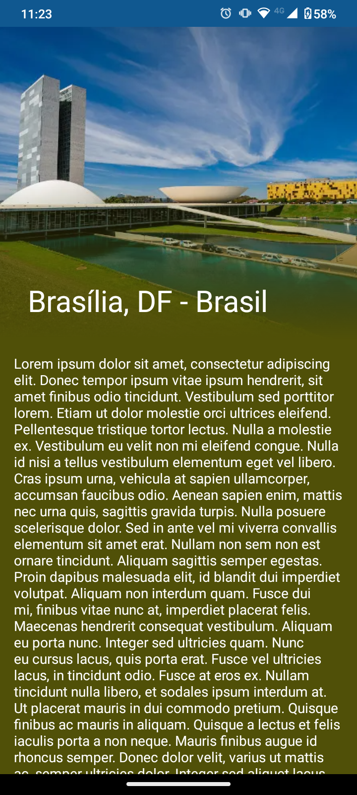
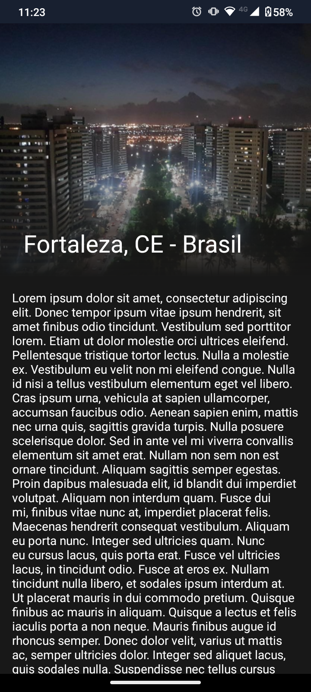
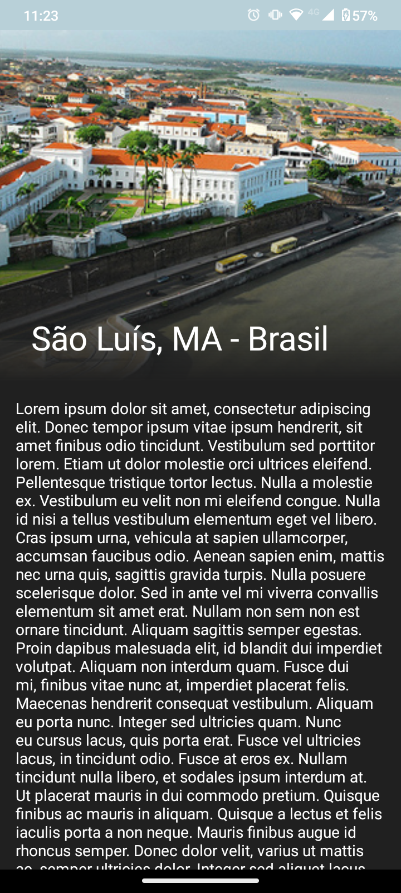

# AndroidCidades

Projeto simples que consiste em uma listagem de cidades que, ao clicar em uma, a tela de detalhes é aberta.
As cores da ActionBar e da StatusBar, bem como a cor do fundo, mudam conforme a imagem de capa.

### Imagens

  
  
  

